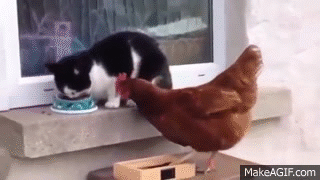

:kissing_cat:

# OOP PROJECT 1 - CHICAT GAME 


## IRONHACK | COURSE STRUCTURE

<p align="center">
  
</p>


---

### Introduction
---
This game is a product of my first Ironhack project. Using DOM manipulation and OOP, CSS and HTML we were tasked to do a game with a win/lose logic and this is the result of my work. 

### Course Structure
---
JavaScript - DOM and OOP
CSS
HTML

### Used Technologies
---
- Github and VSCode

### Personal Opinion
---
I had a lot of fun creating this game. I had a lot of frustrating moment and a lot of blockers but I believe I am quite satisfied with the final result. My blood, sweat and tears ended up making quite an ejoyable game featuring my one of my favourite subjects - cats. I hope you enjoy playing it as much as I do.


### Setup
--- 

If viewing my project in your browser is of your interest, feel free to follow these steps:
```bash
git  clone https://github.com/raffaellacff/chicatgame.git
cd chicatgame
open index.html
```
